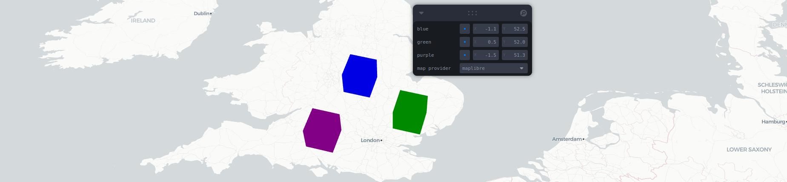

# React Three Map

[](https://github.com/RodrigoHamuy/react-three-map)
[](https://npmjs.com/package/react-three-map)
[](https://bundlephobia.com/result?p=react-three-map)
[](https://github.com/RodrigoHamuy/react-three-map/actions?query=workflow%3Arelease)
[](https://rodrigohamuy.github.io/react-three-map/?story=canvas--a-maplibre-example)
[](https://github.com/sponsors/RodrigoHamuy?frequency=one-time&sponsor=RodrigoHamuy)

`react-three-map` is a bridge to use [`react-three-fiber`](https://github.com/pmndrs/react-three-fiber) inside [`react-map-gl`](https://github.com/visgl/react-map-gl).

Until now you had:

| imperative      | declarative (react) |
| --------------- | ------------------- |
| Maplibre/Mapbox | react-map-gl        |
| THREE.js        | react-three-fiber   |

Now with `react-three-map`, you can use them together :fist_right::star::fist_left:.

```sh
npm install react-three-map
```

- [React Three Map](#react-three-map)
  - [:book: Examples](#book-examples)
  - [:mag: What does it look like?](#mag-what-does-it-look-like)
  - [:thinking: Why we build this?](#thinking-why-we-build-this)
  - [:gear: API](#gear-api)
    - [Canvas](#canvas)
      - [Render Props](#render-props)
      - [Render Props removed from `@react-three/fiber`](#render-props-removed-from-react-threefiber)
    - [Coordinates](#coordinates)
    - [NearCoordinates](#nearcoordinates)
    - [useMap](#usemap)
    - [coordsToVector3](#coordstovector3)
    - [vector3ToCoords](#vector3tocoords)


## :book: Examples

Check out our examples [here](https://rodrigohamuy.github.io/react-three-map) (powered by [Ladle](https://ladle.dev/)).

## :mag: What does it look like?


<table>
  <tbody>
    <tr>
      <td>Let's build the same <code>react-three-fiber</code> basic example, but now it can be inside a map. (<a href="https://codesandbox.io/p/sandbox/react-three-map-gettings-started-dhw34w">live demo</a>).</td>
      <td>
        <a href="https://codesandbox.io/p/sandbox/react-three-map-gettings-started-dhw34w">
          
        </a>
      </td>
    </tr>
  </tbody>
</table>

1. Import `Canvas` from `react-three-map` instead of `@react-three/fiber`.
2. Give it a latitude and longitude so it knows where to position the scene in the map.
3. Everything else should work just as usual.

```jsx
import "maplibre-gl/dist/maplibre-gl.css"
import { createRoot } from 'react-dom/client'
import React, { useRef, useState } from 'react'
import { useFrame } from "@react-three/fiber"
import { useRef, useState } from "react"
import Map from "react-map-gl/maplibre"
import { Canvas } from "react-three-map/maplibre" 
// import { Canvas } from "react-three-map" // if you are using MapBox

function BasicExample() {
  return <Map
    antialias
    initialViewState={{
      latitude: 51,
      longitude: 0,
      zoom: 13,
      pitch: 60
    }}
    mapStyle="https://basemaps.cartocdn.com/gl/positron-gl-style/style.json"
  >
    <Canvas latitude={51} longitude={0}>
      <hemisphereLight
        args={["#ffffff", "#60666C"]}
        position={[1, 4.5, 3]}
      />
      <object3D scale={500}>
        <Box position={[-1.2, 1, 0]} />
        <Box position={[1.2, 1, 0]} />
      </object3D>
    </Canvas>
  </Map>
}
```

## :thinking: Why we build this?

Look [how complex](https://maplibre.org/maplibre-gl-js-docs/example/add-3d-model/) is to add just one ThreeJS object to a map.

Look [how complex](https://docs.pmnd.rs/react-three-fiber/api/canvas#createroot) is to create your custom root for R3F.

You can now replace all that complexity and hundreds of lines of code with the `<Canvas>` component exported by `react-three-map`, which includes a tone of extra features and seamless integration, supporting pointer events, raycasting, and much more, all out of the box.

## :gear: API

### Canvas

Same as in `@react-three/fiber`, the `<Canvas>` object is where you start to define your React Three Fiber Scene. 

```tsx
import "maplibre-gl/dist/maplibre-gl.css"
import Map from "react-map-gl/maplibre"
import { Canvas } from 'react-three-map/maplibre'
// import { Canvas } from "react-three-map" // if you are using MapBox

const App = () => (
  <Map 
    initialViewState={{ latitude: 51, longitude: 0, zoom: 13 }} 
    mapStyle="https://basemaps.cartocdn.com/gl/positron-gl-style/style.json" >
    <Canvas latitude={51} longitude={0}>
      <pointLight position={[10, 10, 10]} />
      <mesh>
        <sphereGeometry />
        <meshStandardMaterial color="hotpink" />
      </mesh>
    </Canvas>
  </Map>
)
```

It shares most of the props from R3F `<Canvas>`, so you can check them directly in the [`@react-three/fiber` docs](https://docs.pmnd.rs/react-three-fiber/api/canvas). There are a few important exceptions though, which are mentioned bellow.

#### Render Props

| Prop      | Description                                      | Default    |
| --------- | ------------------------------------------------ | ---------- |
| latitude  | The latitude coordinate where to add the scene.  |            |
| longitude | The longitude coordinate where to add the scene. |            |
| altitude  | The altitude coordinate where to add the scene.  | `0`        |
| frameloop | Render mode: `"always"`, `"demand"`.             | `"always"` |
| overlay   | Render on a separated canvas.                    | `false`    |

**About `overlay`**

You may want to use `overlay` if:

- You use `react-postprocessing` and have issues clearing the screen.
- Want to avoid unnecesary map renders when only the Three scene changed.

But it comes with some caveats:

- ThreeJS will always render on top, as this is now a separated canvas and doesn't have access to the map depth buffer.
- `react-postprocessing` will also not work if you also use `<Coordinates>` components.

#### Render Props removed from `@react-three/fiber`

Because the scene now lives in a map, we leave a lot of the render and camera control to the map, rather than to R3F.

Therefore, the following `<Canvas>` props are ignored:

- gl
- camera
- resize
- orthographic
- dpr

### Coordinates

[](https://rodrigohamuy.github.io/react-three-map/?story=multi-coordinates--default)

This component allows you to have 3D objects at different coordinates.


```tsx
import { Canvas, Coordinates } from 'react-three-map'

<Canvas latitude={51} longitude={0}>
  <Coordinates latitude={50} longitude={0}>
    <mesh><sphereGeometry /></mesh>
  </Coordinates>
  <Coordinates latitude={52} longitude={0}>
    <mesh><sphereGeometry /></mesh>
  </Coordinates>
</Canvas>
```

| Props     | Description                                      | Default |
| --------- | ------------------------------------------------ | ------- |
| latitude  | The latitude coordinate where to add the scene.  |         |
| longitude | The longitude coordinate where to add the scene. |         |
| altitude  | The altitude coordinate where to add the scene.  | `0`     |

### NearCoordinates

[](https://rodrigohamuy.github.io/react-three-map/?story=multi-coordinates--default)

Same as `Coordinates`, but scale is ignored in exchange of being able to be rendered under the same scene.

Works well at city level distances, but since scale remains unchanged, is not recommended at country level distances.

Check the story to see the difference between the two or check #102 for more info.

### useMap

Access the map from inside `react-three-map`.

```tsx
import { useMap } from "react-three-map";
// import { useMap } from "react-three-map/maplibre"; if you use maplibre
const Component = () => {
  const map = useMap();
  return <>...</>
}

```

### coordsToVector3

[](https://rodrigohamuy.github.io/react-three-map/?story=extrude-coordinates--extrude-coordinates)

This utility function converts geographic coordinates into a `Vector3Tuple`, which represents a 3D vector in meters.

Similar to `NearCoordinates`, remember that this only updates positions (translation) but that scale is not taken into account, which has an important factor at very long distances (country level).


| Parameter        | Description                                                     |
| ---------------- | --------------------------------------------------------------- |
| `point: Coords`  | The geographic coordinates of the point to convert.             |
| `origin: Coords` | The geographic coordinates used as the origin for calculations. |

Returns a `Vector3Tuple` representing the 3D position of the point relative to the origin.

### vector3ToCoords

[](https://rodrigohamuy.github.io/react-three-map/?story=pivot-controls--default)

This utility function converts a `Vector3Tuple`, which represents a 3D vector in meters, back into geographic coordinates.

It is the inverse of `coordsToVector3` but it does not have a good level of precision at long distances since we haven't reverse engineered #102 fix yet.

Recommended to use at city level distances, but margin errors will be noticeable at country level distances.

| Parameter                | Description                                                     |
| ------------------------ | --------------------------------------------------------------- |
| `position: Vector3Tuple` | The 3D vector to convert back into geographic coordinates.      |
| `origin: Coords`         | The geographic coordinates used as the origin for calculations. |

Returns a `Coords` object representing the geographic coordinates of the point relative to the origin.